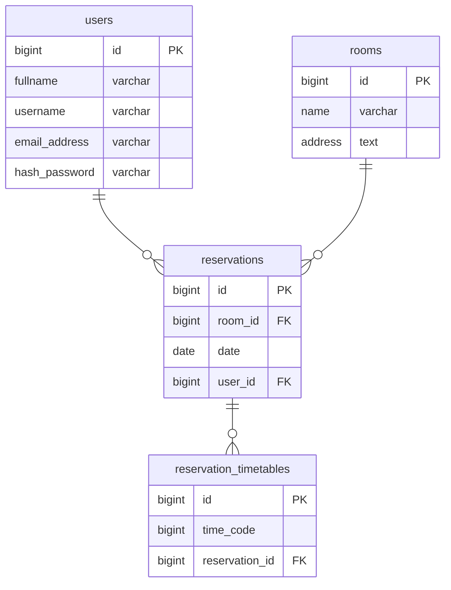

# django部屋予約システム

## ERD

```mermaid

erDiagram

    users ||--o{ reservations:""
    rooms ||--o{ reservations:""
    reservations ||--o{ reservation_timetables: ""
    users {
        bigint id PK
        fullname varchar
        username varchar
        email_address varchar
        hash_password varchar
    }

    rooms {
        bigint id PK
        name varchar
        address text
    }

    reservations {
        bigint id PK
        bigint room_id FK
        date date
        bigint user_id FK
    }
    
    reservation_timetables {
        bigint id PK
        bigint time_code
        bigint reservation_id FK
    }


``` 
